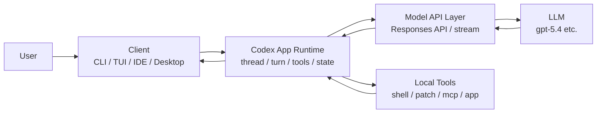
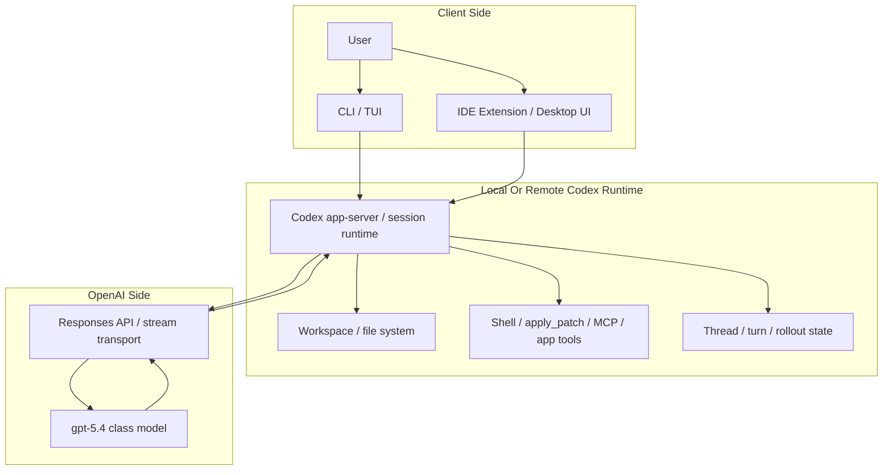
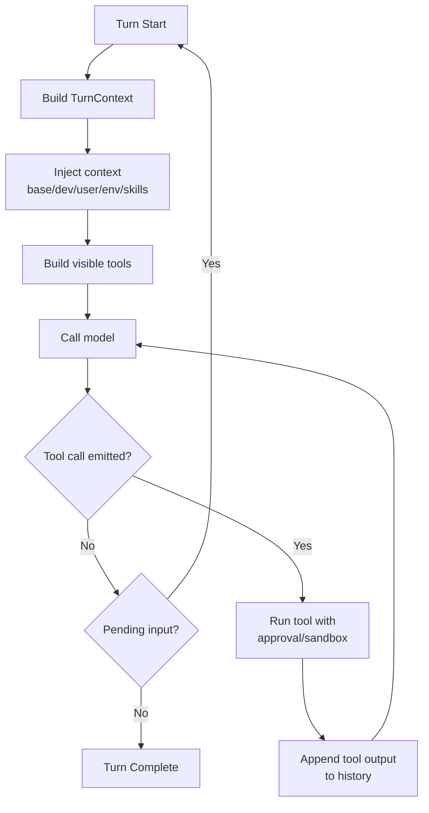
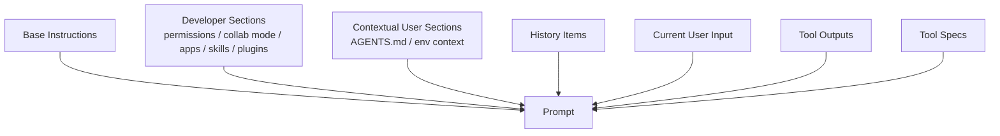
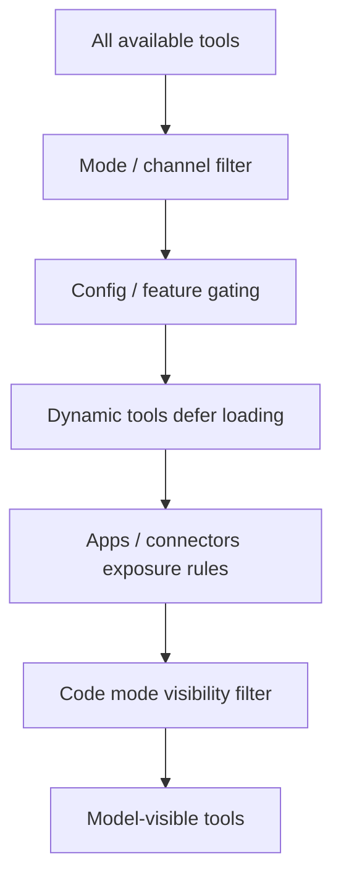

# Codex Agentic Workflow

이 디렉터리는 Codex의 agentic loop와 prompt assembly 방식을 단계별로 정리한 문서 묶음이다.

- 상세 분석: [codex_agentic_loop_analysis.md](/workspace_ssd/gits/github/KnowledgeBase/agentic_workflow/codex_agentic_workflow/codex_agentic_loop_analysis.md)
- 프롬프트 조립 심화: [codex_prompt_assembly_deep_dive.md](/workspace_ssd/gits/github/KnowledgeBase/agentic_workflow/codex_agentic_workflow/codex_prompt_assembly_deep_dive.md)

## 1. 핵심 요약

Codex의 agentic loop는 단발성 completion 호출이 아니라, `thread/session 상태 유지 -> turn context 생성 -> instruction/history/tools 조립 -> 모델 스트리밍 -> tool 실행 -> 결과 재주입 -> 후속 모델 호출`을 반복하는 런타임 루프다.

핵심 포인트는 아래 네 가지다.

- Codex는 세션 상태와 turn 상태를 분리해서 관리한다.
- 모델 입력은 단순 대화 로그가 아니라 `base instructions + developer context + contextual user context + structured history + tool specs`의 조합이다.
- tool 노출은 일부 고정이지만, mode/config/dynamic loading/apps/MCP 상태에 따라 turn마다 달라질 수 있다.
- tool call 외에도 retry, fallback, compaction, approval, subagent 같은 내부 왕복이 존재한다.

## 2. 전체 아키텍처



## 3. Client / Server 계층



이 계층에서 역할을 나누면 아래와 같다.

- client: 입력 수집, turn 시작/중단, 이벤트 표시, 승인 UI
- Codex runtime/app-server: prompt 조립, tool orchestration, history/state 관리
- OpenAI API 계층: 스트리밍, conversation state, transport, 인증
- LLM 계층: 실제 추론과 tool call 결정

## 4. Agentic Loop



이 루프에서 Codex는 단순히 모델 응답만 받는 것이 아니라 아래를 함께 수행한다.

- 현재 작업 환경과 정책을 모델 친화적인 형태로 재구성
- tool schema를 현재 turn 조건에 맞게 노출
- 모델이 낸 function/local shell/custom tool 호출을 실제 실행
- 실행 결과를 다시 구조화된 item으로 conversation history에 기록
- 오류 시 retry 또는 websocket -> HTTPS fallback 수행

## 5. Prompt Assembly 개요

실제 모델 입력은 개념적으로 아래와 비슷하다.

```text
base instructions
+ developer context bundle
+ contextual user bundle
+ prior conversation items
+ current user input
+ tool outputs
+ tool schemas
+ optional personality / output schema / parallel tool call flag
```

이때 중요한 점은 `input`이 단순 문자열 메시지 목록이 아니라 `ResponseItem` 목록이라는 것이다. 여기에 일반 메시지뿐 아니라 function call, tool output, local shell call 같은 구조화된 항목이 들어간다.

## 6. Prompt Assembly 상세 흐름



각 레이어의 역할은 다르다.

- base instructions: 세션 수준의 기본 모델 지침
- developer sections: 정책과 런타임 기능 설명
- contextual user sections: AGENTS.md, 환경 정보 같은 작업 문맥
- history items: 이전 대화, 이전 tool 실행 결과
- current user input: 이번 사용자의 요청
- tool specs: 이번 turn에서 모델이 호출 가능한 도구 정의

## 7. Tools 노출 방식

Codex는 모든 tool을 항상 같은 방식으로 보내는 것이 아니다.



즉 "질문 의미를 보고 그때그때 연관 tool만 semantic search로 고른다"기보다, 더 실제적인 정책 기반 필터링 구조에 가깝다.

## 8. 왜 이 구조가 잘 동작하는가

- 지침과 문맥을 레이어로 나누면 모델이 안정 규칙과 현재 상황을 동시에 더 잘 따른다.
- structured history 덕분에 모델이 실제로 어떤 도구가 실행됐고 어떤 결과가 나왔는지 덜 헷갈린다.
- iterative loop는 `응답 -> 실행 -> 관찰 -> 수정`을 가능하게 해 실제 작업 적합성이 높다.
- approval/sandbox/retry/fallback은 자동화를 유지하면서 실패 비용을 줄인다.
- diff 기반 context update와 compaction은 긴 세션에서 토큰 낭비를 줄인다.

## 9. 문서 가이드

- 구조 전반과 client/server, tools, skills, persona까지 한 번에 보려면 [codex_agentic_loop_analysis.md](/workspace_ssd/gits/github/KnowledgeBase/agentic_workflow/codex_agentic_workflow/codex_agentic_loop_analysis.md)
- 실제 prompt가 turn마다 어떻게 조립되는지 깊게 보려면 [codex_prompt_assembly_deep_dive.md](/workspace_ssd/gits/github/KnowledgeBase/agentic_workflow/codex_agentic_workflow/codex_prompt_assembly_deep_dive.md)
