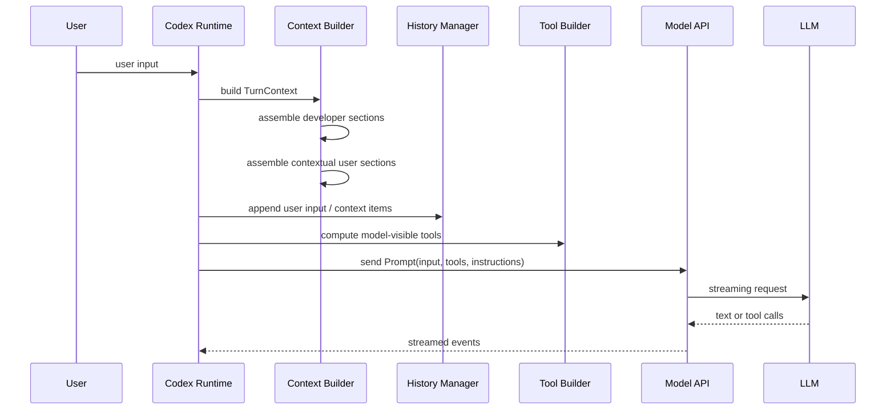
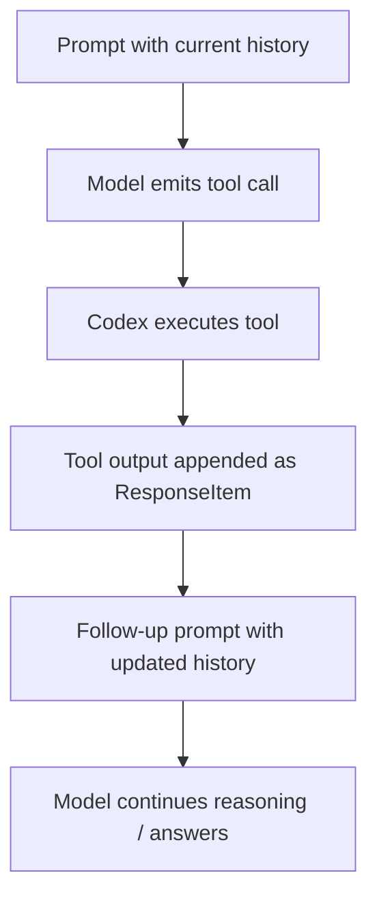

# Codex Prompt Assembly Deep Dive

## 1. 목적

이 문서는 Codex가 한 turn에서 LLM에 무엇을, 어떤 순서와 계층으로 전달하는지에만 집중한 심화 문서다. 특히 아래 질문에 답하는 것을 목표로 한다.

- system instruction은 실제로 어떻게 구성되는가
- AGENTS.md, skills, tools, history, user input은 어디에 들어가는가
- 어떤 항목이 매 turn 고정이고 어떤 항목이 동적으로 바뀌는가
- tool call 이후 후속 모델 호출은 어떤 상태를 이어받는가

## 2. 핵심 결론

Codex의 prompt assembly는 "단일 system prompt + chat history" 모델보다 훨씬 계층적이다. 공개 코드 기준으로 주요 구성요소는 아래와 같다.

1. `base_instructions`
2. developer message bundle
3. contextual user message bundle
4. 기존 conversation `ResponseItem` history
5. 현재 user input
6. tool specs
7. personality / output schema / parallel tool call 설정

즉 모델은 단순 문장 배열이 아니라, 구조화된 상태를 받는다.

## 3. Prompt 객체 관점

공개 코드의 `Prompt`는 대략 아래 필드를 가진다.

```rust
pub struct Prompt {
    pub input: Vec<ResponseItem>,
    pub(crate) tools: Vec<ToolSpec>,
    pub(crate) parallel_tool_calls: bool,
    pub base_instructions: BaseInstructions,
    pub personality: Option<Personality>,
    pub output_schema: Option<Value>,
}
```

중요한 점:

- `input`은 메시지 문자열 배열이 아니라 `ResponseItem` 배열이다.
- `tools`는 이번 turn에서 모델에게 보이는 도구 정의다.
- `base_instructions`는 별도 필드로 들어간다.
- personality와 output schema도 추가 제약 조건으로 붙는다.

## 4. turn 시작 시 payload 예시

초기 user turn에서 모델 API로 넘어가는 payload를 개념적으로 그리면 아래와 비슷하다.

```json
{
  "model": "gpt-5.4",
  "instructions": "<base_instructions>",
  "input": [
    {
      "type": "message",
      "role": "developer",
      "content": [
        "permissions / sandbox instructions",
        "collaboration mode instructions",
        "apps / skills / plugins summary"
      ]
    },
    {
      "type": "message",
      "role": "user",
      "content": [
        "AGENTS.md instructions for /workspace/...",
        "environment context: cwd/date/timezone/shell"
      ]
    },
    {
      "type": "message",
      "role": "user",
      "content": "사용자의 실제 요청"
    }
  ],
  "tools": [
    { "name": "exec_command", "type": "function" },
    { "name": "apply_patch", "type": "custom" },
    { "name": "spawn_agent", "type": "function" }
  ],
  "parallel_tool_calls": true,
  "personality": "pragmatic",
  "output_schema": null
}
```

이 예시는 개념 설명용이다. 실제 wire format은 provider/transport/Responses API schema에 맞게 더 구조화되지만, 의미상으로는 위와 거의 같다.

### 이 예시에서 봐야 할 점

- `instructions`와 `input`은 분리된다.
- AGENTS.md는 일반적으로 contextual user message 쪽에 들어간다.
- tools는 별도 스키마 목록으로 붙는다.
- 세션 초기 turn이라면 history가 짧거나 비어 있을 수 있다.

## 5. 실제 조립 순서

개념적으로는 아래 순서가 가장 가깝다.



실제 구현에서는 이 흐름이 turn마다 약간 달라질 수 있지만, 기본 골격은 비슷하다.

## 6. Base Instructions

`base_instructions`는 세션 수준의 기본 모델 지침이다. 이것은 보통 아래 소스의 합성 결과다.

- 모델별 기본 instruction
- config의 `base_instructions`
- `model_instructions_file`
- collaboration mode나 personality와 결합된 기본 지침

여기서 중요한 점은:

- 이것은 일반 대화 history item 안에 섞이는 정보가 아니다.
- `Prompt`의 별도 필드로 들어간다.
- 따라서 "system prompt 역할"에 가장 가까운 층은 이 부분이다.

다만 실제 최종 행동은 base instructions 하나로 끝나지 않고, 아래 developer/contextual user 레이어들이 덧붙는다.

## 7. Developer Message Bundle

공개 코드의 `build_initial_context()`는 여러 developer section을 모아서 top-level developer message를 만든다.

대표 항목은 아래와 같다.

- model switch update
- permissions / approval / sandbox instructions
- 별도 `developer_instructions`
- memory tool용 developer instructions
- collaboration mode instructions
- realtime update
- personality message
- apps section
- skills summary section
- plugins section
- git commit 관련 instruction

즉 developer bundle은 "모델이 작업을 수행하는 방식"을 규정하는 운영 레이어다.

### 중요한 포인트

- 모든 항목이 항상 매 turn 동일하지 않다.
- permissions, collaboration mode, apps, skills, plugins는 현재 session/turn 조건에 따라 바뀐다.
- guardian reviewer 경로에서는 developer instructions를 분리된 developer message로 따로 넣는 코드 경로도 있다.

## 8. Contextual User Bundle

Codex는 일부 문맥을 developer가 아니라 `user` role의 contextual message로 넣는다.

대표적으로:

- AGENTS.md 기반 user instructions
- environment context
- subagent 정보

공개 코드상 `build_initial_context()`는 이들을 모아 별도 contextual user message를 만든다.

이 설계는 중요한 의미가 있다.

- AGENTS.md는 system prompt가 아니라 contextual user instruction 취급이다.
- 환경 정보도 모델에게 "현재 작업 상황"으로 전달된다.
- 즉 persona와 작업 규칙의 일부는 user-context 레이어에 위치한다.

## 9. AGENTS.md의 실제 주입 방식

공개 코드 `instructions/src/user_instructions.rs`를 보면 AGENTS.md 내용은 특수 wrapper를 씌운 user message로 직렬화된다.

개념적으로는 아래와 비슷하다.

```text
# AGENTS.md instructions for <directory>

<INSTRUCTIONS>
...AGENTS.md contents...
</INSTRUCTIONS>
```

그리고 이것은 `ResponseItem::Message(role="user")`로 들어간다.

### 의미

- AGENTS.md는 top-level system이 아니다.
- 그러나 일반 user 질문과도 다르다.
- 실제로는 "사용자 측 작업 규칙/프로젝트 규칙"을 담은 contextual user message다.

또한 project root에서 현재 cwd까지 여러 `AGENTS.md`를 수집해 합치는 계층형 로직도 존재한다.

## 10. Skills의 실제 주입 방식

skill 관련 정보는 두 층으로 나뉜다.

### 10.1 skill summary

현재 turn에서 암묵적으로 쓸 수 있는 skills 목록은 developer section의 일부로 들어갈 수 있다.

### 10.2 skill body injection

특정 skill이 explicit mention 또는 implicit invocation 대상이 되면, 해당 skill의 본문은 별도 message item으로 주입된다.

skill 본문 wrapper는 대략 아래와 비슷하다.

```text
<skill>
<name>...</name>
<path>...</path>
...skill contents...
</skill>
```

즉 skill은 항상 전부 상시 포함되는 게 아니라:

- 목록은 비교적 상시
- 본문은 필요 시

구조에 더 가깝다.

## 11. Environment Context

Codex는 현재 실행 환경도 prompt에 주입한다.

대표 항목:

- cwd
- current date
- timezone
- shell
- subagent 정보
- 기타 실행 환경 설명

이 정보는 일반적으로 contextual user bundle에 들어간다. 따라서 모델은 "어떤 작업 공간에서, 어떤 시점에, 어떤 환경으로" 실행 중인지 알고 응답할 수 있다.

## 12. History는 어떻게 들어가는가

Codex의 history는 평범한 채팅 로그가 아니다. `ResponseItem` 단위의 append-only 실행 기록에 가깝다.

여기에 들어갈 수 있는 것:

- user message
- assistant message
- function call
- function call output
- custom tool call
- custom tool output
- local shell call
- local shell output

이 구조 덕분에 모델은 "이전 턴에서 셸 명령이 실제로 실행됐고 exit code가 얼마였는지" 같은 실행 사실을 문맥으로 유지할 수 있다.

## 13. tool call 이후 follow-up payload 예시

모델이 tool call을 낸 뒤의 후속 payload는 아래처럼 달라진다.

```json
{
  "model": "gpt-5.4",
  "instructions": "<same or slightly updated base_instructions>",
  "input": [
    { "role": "developer", "content": "developer bundle" },
    { "role": "user", "content": "AGENTS.md + environment context" },
    { "role": "user", "content": "사용자의 실제 요청" },
    {
      "type": "function_call",
      "name": "exec_command",
      "call_id": "call_001",
      "arguments": {
        "cmd": "rg -n \"Prompt\" /tmp/openai-codex -S"
      }
    },
    {
      "type": "function_call_output",
      "call_id": "call_001",
      "output": "Exit code: 0\nOutput:\n..."
    }
  ],
  "tools": [
    { "name": "exec_command", "type": "function" },
    { "name": "apply_patch", "type": "custom" }
  ],
  "parallel_tool_calls": true
}
```

여기서 핵심은 tool 실행 결과가 별도 side channel에만 머무르지 않고, 다음 모델 호출의 `input` history에 구조화된 item으로 편입된다는 점이다.

## 14. Tool Specs는 어떻게 붙는가

turn마다 모든 tool이 동일하게 노출되는 것은 아니다. 공개 코드의 `build_prompt()`는 현재 router의 `model_visible_specs()`를 읽어서 이번 prompt의 `tools` 필드를 만든다.

추가로 아래와 같은 필터가 있다.

- `defer_loading=true`인 dynamic tool은 초기 prompt에서 제외
- code mode nested tool 숨김
- apps/connectors 직접 노출 제한
- config/feature gating

따라서 모델은 "실제 런타임이 현재 turn에서 허용한 도구 집합"만 본다.

## 15. turn마다 바뀌는 것 vs 유지되는 것

### 상대적으로 유지되는 것

- 세션의 base instructions
- 모델과 reasoning preset
- 기본 developer behavior
- 장기 conversation history

### 자주 바뀌는 것

- cwd/date/timezone
- approval/sandbox/network 정책
- collaboration mode 파생 메시지
- apps/skills/plugins 상태
- 명시적으로 언급된 skill injection
- output schema
- model switch update

즉 prompt는 "완전히 새로 생성되는 것"이면서도, 모든 레이어가 매번 동일하게 다시 붙는 것은 아니다.

## 16. 왜 full context 대신 diff를 쓰는가

공개 코드의 `record_context_updates_and_set_reference_context_item()`는 baseline reference context가 없으면 full initial context를 넣고, 있으면 settings diff만 붙이려 한다.

이 설계의 목적은 분명하다.

- 토큰 절약
- 긴 세션 유지
- 불필요한 반복 지침 감소
- 현재 turn과 이전 turn의 차이만 강조

즉 Codex는 turn context를 매번 통째로 재설명하기보다, 상태 스냅샷과 delta 개념으로 다룬다.

## 17. tool call 이후 후속 모델 호출은 어떻게 이어지는가

모델이 tool call을 내면 Codex는 이를 실행하고, 결과를 다시 history에 append한 뒤 후속 sampling을 이어간다.

개념 흐름은 아래와 같다.



중요한 점:

- tool result는 별도 임시 변수로만 쓰는 것이 아니라 conversation state에 편입된다.
- 따라서 후속 모델 호출은 "방금 실행한 결과를 포함한 새 history" 위에서 진행된다.

## 18. client와 model API 사이의 상태 전달

공개 코드와 로그를 보면 Codex는 session-level client와 turn-level client session을 분리한다.

- `ModelClient`
  - 세션 수명 동안 유지
  - auth, provider, conversation id, transport 상태 보유
- `ModelClientSession`
  - 한 turn 동안 사용
  - streaming request/continuation 담당

관련 메커니즘:

- websocket connection reuse
- `conversation_id`
- `previous_response_id`
- turn state header
- turn metadata header

이 구조 덕분에 Codex는 "매번 완전한 stateless API 호출"보다 더 안정적으로 multi-step turn을 이어갈 수 있다.

## 19. compaction은 prompt assembly에서 어떤 의미인가

history가 너무 커지면 그대로는 컨텍스트 창을 초과할 수 있다. 이때 compaction은 다음 역할을 한다.

- 긴 과거 history를 압축
- 중요한 상태만 유지
- baseline context를 다시 세팅
- 이후 turn에서도 이어서 작업 가능하게 함

즉 compaction은 prompt assembly의 예외 처리 기능이 아니라, 장기 실행형 agent에 필수적인 문맥 관리 기능이다.

## 20. 실전적으로 보면 Codex가 모델에 보내는 것은 무엇인가

가장 현실적인 요약은 아래다.

```text
[A] Base Instructions
[B] Developer Context Bundle
[C] Contextual User Bundle
[D] Prior Structured History
[E] Current User Input
[F] Tool Specs
[G] Optional Personality / Output Schema / Parallel Tool Call Flag
```

그리고 turn이 진행되면서 `[D]`에는 tool call/output이 계속 추가된다.

## 21. 자주 생기는 오해

### 오해 1. AGENTS.md가 system prompt다

정확히는 아니다. 공개 코드 기준으로는 contextual user message에 가깝다.

### 오해 2. tool 목록은 항상 질문 의미로 semantic 검색해서 최소화한다

그보다는 정책 기반 필터링 + dynamic loading + 앱 노출 제어가 더 핵심이다.

### 오해 3. 한 user turn은 모델 호출 1번이다

실제로는 스트리밍, tool call, 후속 호출, retry, fallback이 섞이는 다중 호출 turn이다.

### 오해 4. system instruction은 고정된 한 덩어리다

실제 구조는 base/developer/contextual user/history/tool schema가 결합된 다층 구조다.

## 22. 요약

Codex의 prompt assembly를 이해할 때 가장 중요한 문장은 이것이다.

`Codex는 매 turn마다 동일한 프롬프트를 다시 보내는 것이 아니라, 세션의 기준 instruction과 현재 turn의 실행 문맥, 구조화된 history, 현재 유효한 tools를 합성해 새로운 Prompt 객체를 만든다.`

그래서 Codex는 단순 chat wrapper보다 훨씬 에이전트답게 동작할 수 있다.
