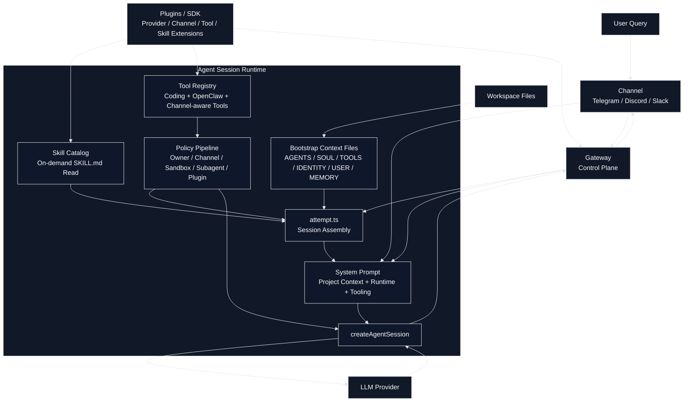

# OpenClaw 분석

## 1. 디렉토리/프로젝트의 목적

`openclaw`는 TypeScript 기반의 개인용 에이전트 런타임이자 게이트웨이 중심 플랫폼이다. 단일 LLM 호출기라기보다 다음 요소들을 결합한 오케스트레이션 레이어에 가깝다.

- `gateway`: 장기 실행 프로세스, 세션/채널/설정 반영의 제어면
- `agent`: 실제 LLM 세션, system prompt 조립, tool 등록, skill 노출
- `channel`: Telegram/Discord/Slack 등 외부 메시지 표면
- `plugins`: provider/channel/tool 확장 지점
- `skills`: 작업별 지침 번들
- `workspace bootstrap files`: `AGENTS.md`, `SOUL.md`, `TOOLS.md`, `IDENTITY.md`, `USER.md`, `HEARTBEAT.md`, `BOOTSTRAP.md`, `MEMORY.md`

핵심은 "강한 플러그인/정책 레이어 위에 coding-agent를 얹은 구조"라는 점이다.

## 2. 구조 다이어그램

## 3. 핵심 구성요소와 역할

### agent

- 에이전트 실행 진입점은 주로 [`openclaw/src/agents/pi-embedded-runner/run/attempt.ts`](openclaw/src/agents/pi-embedded-runner/run/attempt.ts)이다.
- 여기서 다음을 한 번에 조립한다.
  - skill 목록과 skill prompt
  - bootstrap context files
  - tool registry
  - sandbox/runtime 정보
  - system prompt
  - session history 보정/정리
- 최종적으로 `createAgentSession(...)`에 system prompt override와 tool definitions를 주입한다.

### gateway

- OpenClaw는 `gateway`를 장기 실행 서비스로 보고, agent는 그 위에서 돌아가는 세션 단위 실행체다.
- system prompt에서도 `gateway`를 별도 tool로 노출하며 재시작/설정 반영/업데이트까지 제어 대상으로 본다.
- 즉, 게이트웨이는 단순 프록시가 아니라 "실행 환경의 운영면(control plane)"이다.

### channel

- 채널은 단순 입출력 인터페이스가 아니라 capability를 가진 라우팅 표면이다.
- 현재 channel에 따라 system prompt에 반응, reply tag, inline button, message action 힌트가 달라진다.
- `message` tool도 channel capability를 반영해 같은 이름이더라도 실사용 의미가 달라진다.

### plugins / SDK

- `AGENTS.md`에 나온 것처럼 OpenClaw는 plugin/channel/provider SDK 경계가 강하다.
- core가 모든 provider별 로직을 직접 품기보다, plugin registry와 documented seam을 통해 확장하는 구조다.
- 그래서 `tool`, `provider`, `channel`, `skill`이 전부 같은 계층이 아니라 각기 다른 등록/정책 경로를 가진다.

## 4. md 파일들의 역할

OpenClaw에서 md 파일은 "에이전트가 필요 시 읽는 문서"가 아니라, 상당수가 실행 전에 bootstrap context로 주입되는 워크스페이스 설정층이다.

### 어떤 파일을 로드하는가

[`openclaw/src/agents/workspace.ts`](openclaw/src/agents/workspace.ts)에서 기본 bootstrap 파일 이름들을 정의한다.

- `AGENTS.md`
- `SOUL.md`
- `TOOLS.md`
- `IDENTITY.md`
- `USER.md`
- `HEARTBEAT.md`
- `BOOTSTRAP.md`
- `MEMORY.md`
- `memory.md`

### 실제 주입 경로

1. [`openclaw/src/agents/bootstrap-files.ts`](openclaw/src/agents/bootstrap-files.ts)
   워크스페이스 bootstrap 파일을 로드하고
2. `buildBootstrapContextFiles(...)`로 예산에 맞게 잘라
3. [`openclaw/src/agents/system-prompt.ts`](openclaw/src/agents/system-prompt.ts)의 `# Project Context` 아래에 넣는다.

즉 OpenClaw의 md 파일은 주로 "system prompt의 Project Context 섹션"으로 들어간다.

### 파일별 성격

- `AGENTS.md`: 작업 규칙, 저장소/워크스페이스 규범
- `SOUL.md`: 말투/페르소나/태도
- `TOOLS.md`: 외부 도구 사용 가이드
- `IDENTITY.md`, `USER.md`: 자기 정체성/사용자 정보
- `HEARTBEAT.md`: heartbeat 세션용 경량 문맥
- `BOOTSTRAP.md`: 초기 안내나 첫 실행용 문맥
- `MEMORY.md`: 장기 기억 요약

### 특징

- 전부 무조건 넣는 것이 아니다.
- `lightweight` 모드에서는 cron/default 실행에서 bootstrap을 비우고, heartbeat에서는 `HEARTBEAT.md`만 남길 수 있다.
- 내용이 크면 잘리고, 총 예산도 별도로 적용된다.
- `SOUL.md`가 포함되면 system prompt에서 "그 톤과 페르소나를 따르라"는 추가 지시가 붙는다.

## 5. skills의 역할과 특징

### 로딩 방식

[`openclaw/src/agents/skills/workspace.ts`](openclaw/src/agents/skills/workspace.ts)가 skill discovery의 중심이다.

- 로드 소스:
  - bundled skills
  - managed skills
  - 개인 `~/.agents/skills`
  - 프로젝트 `.agents/skills`
  - workspace `skills/`
  - plugin skill dirs
- precedence도 명시적이다.

### skill이 prompt에 들어가는 방식

OpenClaw는 skill 본문을 처음부터 system prompt에 전부 넣지 않는다.

- `resolveSkillsPromptForRun(...)`가 만든 `skillsPrompt`는 skill catalog 성격이다.
- [`openclaw/src/agents/system-prompt.ts`](openclaw/src/agents/system-prompt.ts)의 `## Skills (mandatory)` 섹션은:
  - 먼저 `<available_skills>`의 `<description>`을 훑고
  - 정확히 하나가 맞으면
  - 그때 `read` tool로 해당 `SKILL.md`를 읽으라고 지시한다.

즉 OpenClaw의 skill은 기본적으로 "지연 로딩되는 작업 지침"이다.

### query와 skill의 관계

- 일반 질의:
  - skill 설명 목록만 보고, 해당되는 skill이 없으면 아무 `SKILL.md`도 읽지 않는다.
- skill이 필요한 질의:
  - 가장 구체적인 skill 하나를 고른 뒤
  - `read`로 `SKILL.md`를 읽고
  - 그 지침을 따른다.

중요한 점은 "user query에 따라 system prompt 전체가 새로 바뀐다"기보다, 같은 system prompt 안에 "필요할 때만 skill 하나를 읽어라"는 절차가 들어 있다는 것이다.

### query 기반 skill filtering 여부

코드상으로는 query에 따라 skill 목록 자체를 동적으로 줄이는 경로는 확인되지 않았다.

- `filterSkillEntries(...)`는
  - config
  - eligibility
  - 명시적 `skillFilter`
  - invocation policy
  를 기준으로 skill을 거른다.
- 그러나 "현재 사용자 질의 텍스트"를 해석해 skill catalog를 줄이는 로직은 확인되지 않았다.

정리하면:

- OpenClaw는 skill catalog를 미리 넣는다.
- 실제 질의에 따라 model이 그중 하나를 고르고 `read`로 본문을 읽는다.
- skill selection은 LLM 추론에 맡기고, 코드가 query-semantic filtering을 강하게 수행하지는 않는다.

## 6. tools의 역할과 특징

### tool 생성

[`openclaw/src/agents/pi-tools.ts`](openclaw/src/agents/pi-tools.ts)의 `createOpenClawCodingTools(...)`가 중심이다.

- 기본 coding tools
- OpenClaw 전용 tools
- channel-aware tools
- exec/process/message/gateway/cron/nodes 등
- plugin metadata 연동

을 조합한다.

### tool 정책 레이어

OpenClaw는 tool 정책이 강하다. tool은 단순 등록 후 전부 노출되는 구조가 아니다.

실제 필터링 단계:

- message provider별 허용/거부
- owner-only tool 제거
- profile/global/agent/group/sandbox/subagent policy pipeline
- schema 정규화
- before-tool-call hook 래핑
- abort signal 래핑

즉 OpenClaw의 tool filtering은 "질의 기반"보다 "정책 기반"이 훨씬 강하다.

### 일반 질의 vs tool 사용 질의

- 일반 질의라도 system prompt에는 tool 목록이 포함된다.
- 다만 model이 tool을 호출하지 않으면 그냥 답변만 한다.
- tool 사용 질의일 때는 같은 prompt를 바탕으로 tool call을 발생시킨다.
- 별도의 "tool 질의 전용 system prompt"를 새로 만드는 구조는 아니고, 같은 prompt 안에서 tool 사용 규칙이 늘 존재한다.

## 7. system instruction / tools / user input 전달 흐름

### 조립 순서

실행 경로 기준으로 보면:

1. skill entries 로드
2. `skillsPrompt` 생성
3. bootstrap files 로드 후 context files 생성
4. tools 생성 및 정책 적용
5. runtime/channel/sandbox 정보 수집
6. `buildEmbeddedSystemPrompt(...)`
7. session에 system prompt override 적용

### system prompt에 실제로 들어가는 것

[`openclaw/src/agents/system-prompt.ts`](openclaw/src/agents/system-prompt.ts)에 보면 대략 다음 순서로 들어간다.

- assistant identity
- Tooling
- Tool Call Style
- Safety
- OpenClaw CLI Quick Reference
- Skills
- Memory
- Self-update / model alias / workspace / docs / sandbox
- Authorized senders / time
- Workspace Files (injected)
- Messaging / Voice / Group Chat Context / Reactions / Reasoning Format
- `# Project Context`

그리고 `# Project Context` 아래에 bootstrap md 파일들의 실제 내용이 붙는다.

### user input 전달

- user input은 별도 query classifier에 의해 모델 routing에 영향을 줄 수 있지만
- 현재 분석 범위에서 user input에 따라 tools나 skills catalog가 직접 재구성되지는 않는다.
- 도구 사용 여부는 대부분 모델 판단 + policy gate 조합이다.

## 8. query 연계 tool filtering 여부

### 결론

OpenClaw 내부에서 "사용자 질의 의미를 분석해서 관련 tool 일부만 의도적으로 골라 prompt에 올리는" 적극적 query-semantic filtering은 이번 조사 범위에서 확인하지 못했다.

### 확인된 것은 무엇인가

- policy 기반 filtering: 있음
- owner/channel/sandbox/subagent 기반 filtering: 있음
- plugin allowlist/denylist 기반 filtering: 있음
- model/tool compatibility 기반 filtering: 일부 있음
- user query semantic 기반 filtering: 뚜렷한 구현은 확인 못함

주의할 점:

- `allowedToolNames`는 tool 노출을 동적으로 줄이는 주체가 아니라
  transcript sanitization, malformed tool-call normalization, guard 용도에 더 가깝다.
- 즉 OpenClaw는 "질의 기반 tool shortlist"보다 "정책 기반 tool universe 제한 + model에게 선택 맡김"에 더 가깝다.

## 9. 특징 요약

- OpenClaw는 plugin/SDK 경계가 강한 대형 오케스트레이터다.
- md 파일은 system prompt의 Project Context로 주입되는 bootstrap 성격이 강하다.
- skill은 전체 본문 사전주입형이 아니라 catalog + on-demand read 방식이다.
- tool filtering은 강하지만 대부분 정책/권한 기반이다.
- 일반 질의와 skill/tool 질의의 차이는 주로 "모델이 같은 prompt 안에서 skill read/tool call을 하느냐"에 있다.
