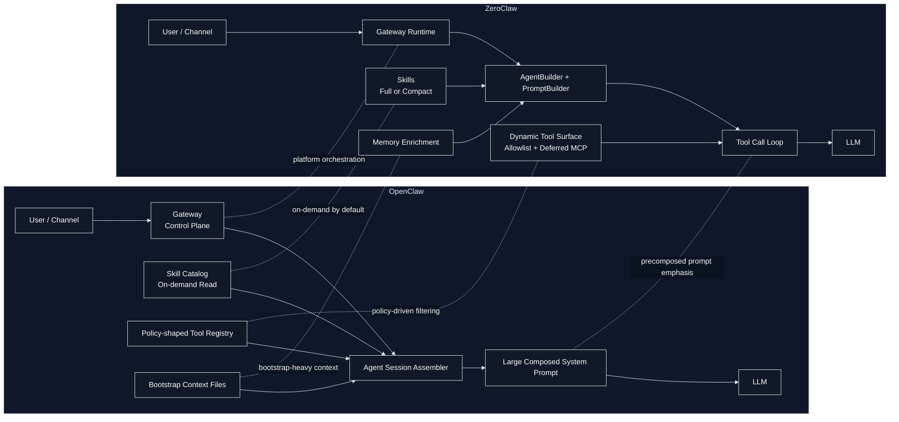

# OpenClaw vs ZeroClaw 비교

## 1. 비교 목적

이 문서는 본 디렉토리의 README가 요구한 관점에 맞추어, `openclaw-analysis.md`와 `zeroclaw-analysis.md`를 바탕으로 OpenClaw와 ZeroClaw를 agentic workflow 관점에서 비교한다. 비교의 초점은 다음과 같다.

- 두 시스템의 아키텍처가 agent 동작 방식에 어떤 차이를 만드는가
- agent, gateway, channel, tools, skills, memory, bootstrap md 파일들이 어떻게 결합되는가
- system instruction, tools 정보, user input이 LLM에 전달될 때 어떤 설계 철학 차이가 드러나는가
- 일반 질의와 skill/tool 사용 질의에서 실제 실행 표면이 어떻게 달라지는가
- query와 연계된 tool filtering이나 기타 agent 설정이 얼마나 명시적으로 구현되어 있는가

## 2. 한눈에 보는 결론

OpenClaw와 ZeroClaw는 모두 `agent + gateway + channel + tools + skills + memory` 구성을 가지는 personal assistant 계열 런타임이지만, 내부 설계 철학은 상당히 다르다.

- OpenClaw는 `gateway`와 `plugin/policy` 계층이 강한 오케스트레이터에 가깝다.
- ZeroClaw는 Rust 단일 바이너리 내부에서 prompt builder, tool loop, filtering, memory를 직접 통합한 로컬 우선 런타임에 가깝다.

즉, OpenClaw의 개성은 "확장성과 정책 중심의 간접 제어"에서 나오고, ZeroClaw의 개성은 "단일 런타임 안에서의 명시적 제어와 동적 tool surface 관리"에서 나온다.

## 3. 구조 비교 다이어그램

## 4. 비교표

| 비교 항목 | OpenClaw | ZeroClaw |
| --- | --- | --- |
| 전체 성격 | TypeScript 기반 gateway 중심 오케스트레이션 플랫폼 | Rust 단일 바이너리 기반 로컬 우선 assistant 런타임 |
| 아키텍처 중심축 | plugin, provider, channel, tool, skill을 정책 레이어 위에서 조합 | agent, prompt builder, tool loop, memory를 내부 모듈로 직접 결합 |
| agent의 핵심 실행점 | `attempt.ts`에서 skill, bootstrap, tools, runtime, system prompt를 한 번에 조립 | `AgentBuilder`와 `agent.rs`에서 provider, tools, memory, skills, prompt builder를 조립 |
| gateway의 성격 | control plane 성격이 강하며 재시작, 설정 반영, 운영 제어 대상 | 대시보드, 채널, MCP, prompt 생성까지 묶는 운영 계층 |
| channel 처리 | 채널 capability에 따라 prompt와 message tool 의미가 달라짐 | channel path 자체가 별도 prompt builder를 가짐 |
| md 파일 위치 | bootstrap context files로 수집되어 주로 `# Project Context`에 주입 | personality/bootstrap 계층으로 로드되어 identity 섹션과 channel runtime prompt에 직접 주입 |
| skill 주입 기본 철학 | catalog를 먼저 주고, 필요 시 `read`로 `SKILL.md`를 읽는 온디맨드형 | `full`과 `compact` 두 모드를 모두 지원 |
| tool 운영 철학 | 정책 기반 tool filtering이 강함 | allowlist, iteration별 재계산, deferred MCP 등 실행 중 tool surface 제어가 강함 |
| query 기반 tool filtering | 뚜렷한 semantic filtering은 확인되지 않음 | MCP 계열에서는 keyword 기반 filtering이 실제 구현됨 |
| memory 모델 | `MEMORY.md` 등 bootstrap 문맥 주입이 중요 | curated `MEMORY.md`와 daily memory를 분리 운영 |
| 확장 방식 | plugin/SDK seam이 강하고 외부 확장에 친화적 | 내부 모듈 결합이 강하지만 MCP와 skill audit를 통해 안전하게 확장 |
| agent 설정의 인상 | sandbox, channel, owner, policy, subagent 등 운영 정책 변수가 많음 | allowed_tools, excluded_tools, autonomy, deferred loading 등 실행 표면 제어가 명시적 |

## 5. 아키텍처 비교

### OpenClaw

OpenClaw는 agent 하나만 보는 구조가 아니라, `gateway`를 중심으로 채널, 세션, tool 정책, plugin registry를 엮는 운영 플랫폼에 가깝다. 이 때문에 agent의 특성도 "LLM 세션 자체"보다는 "정책과 확장점 위에서 동작하는 세션 실행체"로 드러난다.

핵심 특징은 다음과 같다.

- agent는 gateway 위에서 돌아가는 세션 단위 실행체다.
- tool, provider, channel, skill이 각각 별도 등록 경로와 정책 경로를 가진다.
- plugin/SDK 경계가 강해서 코어가 모든 기능을 직접 품기보다 확장 레이어를 통해 기능을 수용한다.

### ZeroClaw

ZeroClaw는 OpenClaw보다 훨씬 직접적인 내부 결합 구조를 가진다. `AgentBuilder`, `SystemPromptBuilder`, tool loop, memory loader, channel runtime이 Rust 모듈 안에서 비교적 명시적으로 연결된다.

핵심 특징은 다음과 같다.

- agent가 provider, tools, memory, skills, prompt builder를 직접 소유하고 조립한다.
- gateway도 분리된 외부 control plane이라기보다 런타임 운영 계층의 일부로 결합되어 있다.
- tool spec 재구성, deferred MCP 활성화, memory enrichment 같은 런타임 동작이 코드상에 직접 드러난다.

### 의미 있는 차이

- OpenClaw는 "확장 가능한 플랫폼" 성격이 강하다.
- ZeroClaw는 "명시적으로 제어 가능한 실행 엔진" 성격이 강하다.
- 따라서 OpenClaw의 분석 포인트는 정책/플러그인/운영면이고, ZeroClaw의 분석 포인트는 prompt/tool loop/memory pipeline 그 자체다.

## 6. 구성요소별 비교

### agent

두 시스템 모두 agent가 system prompt 조립과 tool 사용의 중심이지만, 역할의 무게중심이 다르다.

- OpenClaw agent는 여러 외부 정책과 bootstrap 문맥을 끌어와 최종 세션을 구성하는 조립자에 가깝다.
- ZeroClaw agent는 provider 호출, history 처리, memory enrichment, tool loop까지 직접 수행하는 실행기 성격이 더 강하다.

### gateway

- OpenClaw gateway는 control plane으로서의 의미가 더 크다.
- ZeroClaw gateway는 dashboard, channels, MCP, prompt generation을 엮는 운영 허브에 가깝다.

즉 OpenClaw는 gateway가 "운영 정책과 런타임 제어"를 담당하고, ZeroClaw는 gateway가 "런타임 기능 결합부" 역할까지 더 강하게 수행한다.

### channel

둘 다 Telegram/Discord/Slack 같은 채널을 지원하지만, channel이 prompt에 반영되는 방식은 차이가 있다.

- OpenClaw는 channel capability에 따라 동일한 tool의 의미와 prompt 힌트가 달라진다.
- ZeroClaw는 channel path 자체에 별도 prompt builder가 있어, non-CLI 환경 제약과 autonomy 설정을 직접 반영한다.

### md 파일들

둘 다 `AGENTS.md`, `SOUL.md`, `TOOLS.md`, `IDENTITY.md`, `USER.md`, `BOOTSTRAP.md`, `MEMORY.md` 계열 파일을 agent 문맥의 중요한 일부로 사용한다. 다만 주입 방식의 성격은 다르다.

- OpenClaw는 이 파일들을 bootstrap context files로 읽고, 예산에 맞게 잘라 `# Project Context` 아래에 붙인다.
- ZeroClaw는 personality/bootstrap 파일로 더 직접적으로 다루며, channel runtime에서는 "이미 prompt에 주입되었으니 다시 읽지 말라"는 규칙까지 함께 넣는다.

이 차이는 OpenClaw가 md 파일을 "워크스페이스 문맥 번들"로 취급하는 반면, ZeroClaw가 이를 "행동과 정체성을 규정하는 1급 구성요소"로 취급함을 보여준다.

## 7. System Prompt, Tools, User Input 전달 방식 비교

### OpenClaw

OpenClaw의 흐름은 다음과 같이 요약된다.

1. skill entries 로드
2. skills prompt 생성
3. bootstrap files 로드
4. tools 생성 및 정책 적용
5. runtime, channel, sandbox 정보 수집
6. 최종 system prompt 생성
7. session override로 주입

핵심은 다양한 문맥과 정책을 모아 하나의 큰 system prompt와 tool surface를 만드는 방식이라는 점이다.

### ZeroClaw

ZeroClaw는 agent path와 channel path 모두에서 prompt 조립이 비교적 명시적이다.

1. tool instructions 수집
2. prompt context 생성
3. system prompt builder로 섹션 조립
4. user message에 날짜/시간과 memory context를 결합
5. iteration별 tool spec 재계산

즉 ZeroClaw는 system prompt 조립뿐 아니라, user input이 provider에 전달되기 직전 어떤 문맥으로 enrich되는지도 더 구조적으로 드러난다.

### 차이의 핵심

- OpenClaw는 "실행 전 조립된 운영 문맥"의 비중이 크다.
- ZeroClaw는 "실행 중 재계산되는 tool surface와 memory 문맥"의 비중이 크다.

## 8. Skills 비교

### 공통점

- 둘 다 skill을 별도 디렉토리/레지스트리에서 로드한다.
- 둘 다 모든 skill 본문을 무조건 고정 주입하는 구조는 아니다.
- 둘 다 일반 질의와 skill 관련 질의를 같은 agent 틀 안에서 처리한다.

### OpenClaw의 특징

- 기본 전략은 `skill catalog + on-demand read`다.
- system prompt는 먼저 skill 설명 목록을 보여주고, 정말 맞는 skill이 하나 있을 때만 `SKILL.md`를 읽으라고 지시한다.
- query에 따라 skill 목록 자체를 semantic하게 줄이는 로직은 분석 범위에서 확인되지 않았다.

### ZeroClaw의 특징

- `full`과 `compact` 두 가지 skill 주입 모드를 가진다.
- `full`에서는 skill instruction이 system prompt 안에 직접 들어간다.
- `compact`에서는 요약만 넣고 `read_skill(name)`으로 상세를 로드한다.
- skill 로딩 자체에도 security audit와 script 제한이 걸려 있어 capability 관리가 더 보수적이다.

### 의미 있는 차이

- OpenClaw는 skill을 "필요 시 읽는 외부 작업 지침"으로 다루는 경향이 강하다.
- ZeroClaw는 config에 따라 skill을 "항상 prompt에 포함되는 지식" 또는 "필요 시 읽는 지식"으로 모두 다룰 수 있다.

즉 skill 처리만 놓고 보면 ZeroClaw가 더 명시적인 주입 전략 옵션을 제공하고, OpenClaw는 기본적으로 모델 추론에 맡기는 catalog 접근을 선호한다.

## 9. Tools 및 Tool Filtering 비교

### 공통점

- 두 시스템 모두 tool을 agent의 핵심 capability로 본다.
- 일반 질의에서도 tool 정의가 provider에 함께 전달될 수 있다.
- tool 사용 여부는 결국 모델 판단과 runtime 제한의 결합으로 결정된다.

### OpenClaw의 특징

- tool filtering은 매우 강하지만 중심축은 policy다.
- owner-only, provider별 허용/거부, sandbox, subagent, plugin allowlist/denylist 등이 중요한 기준이다.
- 즉 "현재 질의와 어떤 tool이 의미적으로 관련 있는가"보다 "현재 실행 정책상 어떤 tool을 노출해도 되는가"를 더 중시한다.

### ZeroClaw의 특징

- `allowed_tools`로 registry 자체를 줄일 수 있다.
- tool spec은 iteration마다 재계산된다.
- deferred MCP를 사용하면 처음부터 MCP schema를 다 보내지 않고 `tool_search`를 통해 필요한 부분만 활성화한다.
- `tool_filter_groups`에서는 user message keyword와 연계된 동적 활성화가 실제 구현되어 있다.

### 의미 있는 차이

- OpenClaw의 tool filtering은 운영 정책 최적화에 가깝다.
- ZeroClaw의 tool filtering은 prompt 크기 제어와 query 연계 활성화까지 포함하는 실행 최적화에 가깝다.

README가 특별히 요구한 "질의와 연계된 tool filtering 여부"에 대해 정리하면 다음과 같다.

- OpenClaw: 뚜렷한 query-semantic tool filtering은 확인되지 않았다.
- ZeroClaw: MCP 계열에서 keyword 기반 query 연계 filtering이 실제로 존재한다.

## 10. Memory와 Bootstrap 문맥 비교

### OpenClaw

- `MEMORY.md`와 기타 bootstrap md 파일이 system prompt의 project context 일부로 들어간다.
- lightweight 모드나 heartbeat 모드처럼 실행 성격에 따라 bootstrap 문맥을 줄이는 경로가 있다.

### ZeroClaw

- `MEMORY.md`는 curated long-term memory로 prompt에 주입될 수 있다.
- `memory/*.md`는 daily memory로 분리되어 기본 prompt에 직접 넣지 않고 memory tool로 접근한다.
- user input 전달 시 retrieved memory context가 함께 붙을 수 있다.

### 의미 있는 차이

- OpenClaw는 memory를 bootstrap 문맥 계층과 함께 다루는 성격이 강하다.
- ZeroClaw는 curated memory와 operational memory를 분리하고, retrieval 경로까지 런타임에 녹여 놓았다.

## 11. 기타 Agent 설정 비교

README가 요구한 "기타 agent 설정" 관점에서도 차이가 분명하다.

### OpenClaw 쪽에서 두드러지는 설정

- channel-aware message behavior
- sandbox/runtime 정보 반영
- owner/channel/subagent/policy pipeline
- lightweight mode, heartbeat mode 같은 실행 유형별 bootstrap 차등 처리
- SOUL.md 존재 시 톤/페르소나 추가 지시

이 설정들은 주로 "운영 조건과 정책을 어떻게 prompt와 tool surface에 반영하는가"에 집중되어 있다.

### ZeroClaw 쪽에서 두드러지는 설정

- `allowed_tools`에 의한 강한 allowlist
- `excluded_tools`와 iteration별 tool spec 재계산
- channel path의 autonomy 반영
- deferred MCP loading과 `tool_search`
- skill security audit, `allow_scripts=false` 기본값

이 설정들은 주로 "실행 시점에 capability를 얼마나 정밀하게 열고 닫을 것인가"에 집중되어 있다.

## 12. 핵심 유사점

- 둘 다 agent, gateway, channel, tools, skills, memory를 포함하는 종합 assistant 런타임이다.
- 둘 다 md 파일을 단순 문서가 아니라 agent 행동을 규정하는 bootstrap/personality 문맥으로 사용한다.
- 둘 다 일반 질의와 tool/skill 질의를 별도 제품으로 나누지 않고 같은 agent 루프 안에서 처리한다.
- 둘 다 tool을 많이 다루며, 무제한 노출 대신 어떤 형태로든 filtering 또는 제한 전략을 둔다.
- 둘 다 channel 특성과 runtime 조건을 system prompt 또는 tool surface에 반영한다.

## 13. 핵심 차이점

- OpenClaw는 plugin/SDK와 정책 레이어가 강한 플랫폼형 구조이고, ZeroClaw는 단일 런타임 안에서 내부 모듈이 직접 연결된 엔진형 구조다.
- OpenClaw의 skill 기본 전략은 catalog 기반 온디맨드 로딩이고, ZeroClaw는 `full`/`compact` 두 모드로 사전주입형과 온디맨드형을 모두 지원한다.
- OpenClaw의 tool filtering은 정책 중심이고, ZeroClaw의 tool filtering은 query keyword 기반 동적 활성화와 deferred loading까지 포함한다.
- OpenClaw는 bootstrap context를 큰 system prompt 안에 넣는 성격이 강하고, ZeroClaw는 memory enrichment와 iteration별 tool spec 재구성처럼 실행 중 동작이 더 명시적이다.
- OpenClaw는 gateway 중심 control plane 성격이 강하고, ZeroClaw는 agent loop 자체의 제어 가능성이 더 직접적으로 드러난다.

## 14. 최종 해석

agentic workflow 관점에서 보면, OpenClaw와 ZeroClaw는 비슷한 외형을 공유하지만 서로 다른 최적화 목표를 가진다.

- OpenClaw는 많은 채널, plugin, 정책, 운영 규칙을 안정적으로 얹을 수 있는 "확장 가능한 agent 플랫폼" 쪽으로 최적화되어 있다.
- ZeroClaw는 prompt 조립, memory 주입, tool surface 변화를 코드 수준에서 세밀하게 통제할 수 있는 "직접 제어형 agent 런타임" 쪽으로 최적화되어 있다.

따라서 같은 기능 표면을 보더라도, OpenClaw의 차별점은 정책/확장성/운영면에 있고, ZeroClaw의 차별점은 동적 tool 제어, 명시적 prompt 구성, 로컬 우선 capability 관리에 있다고 정리할 수 있다.
